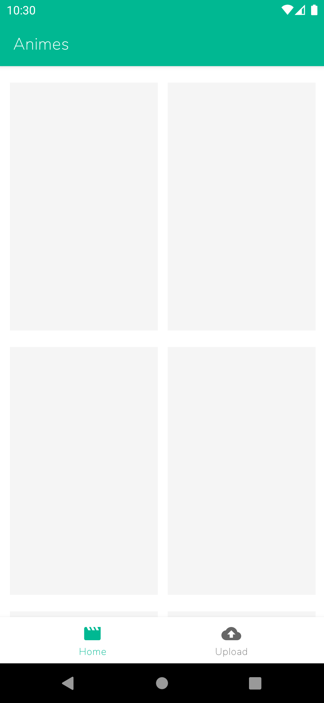
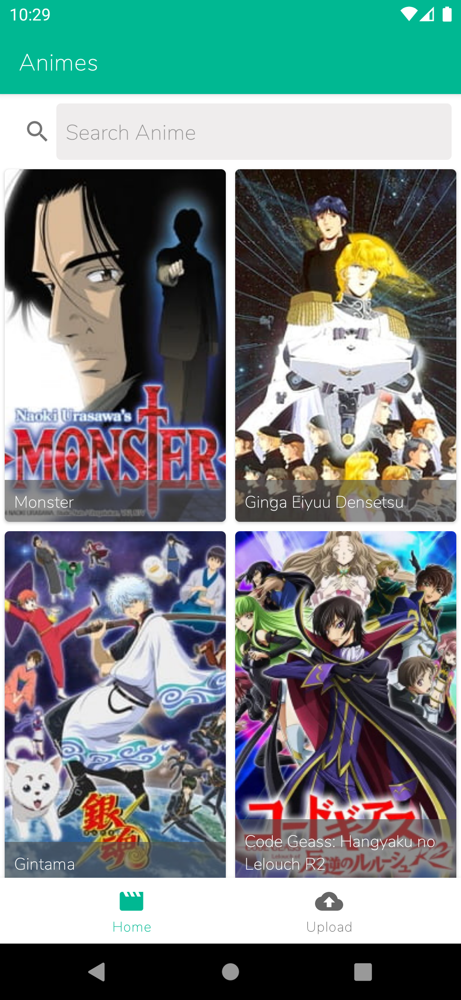
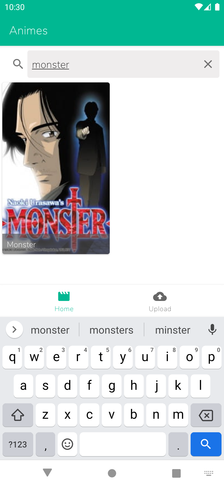
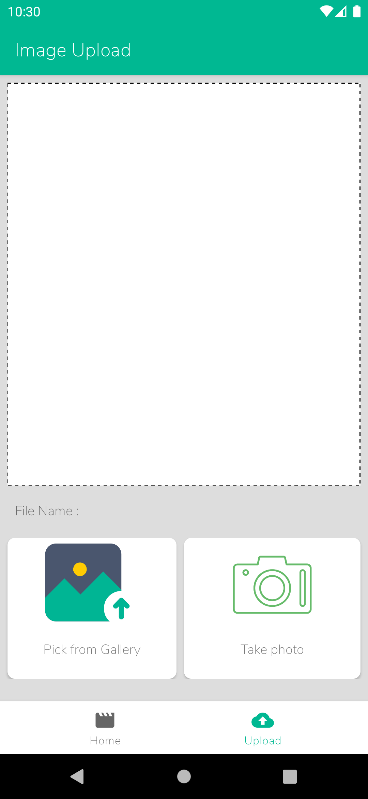
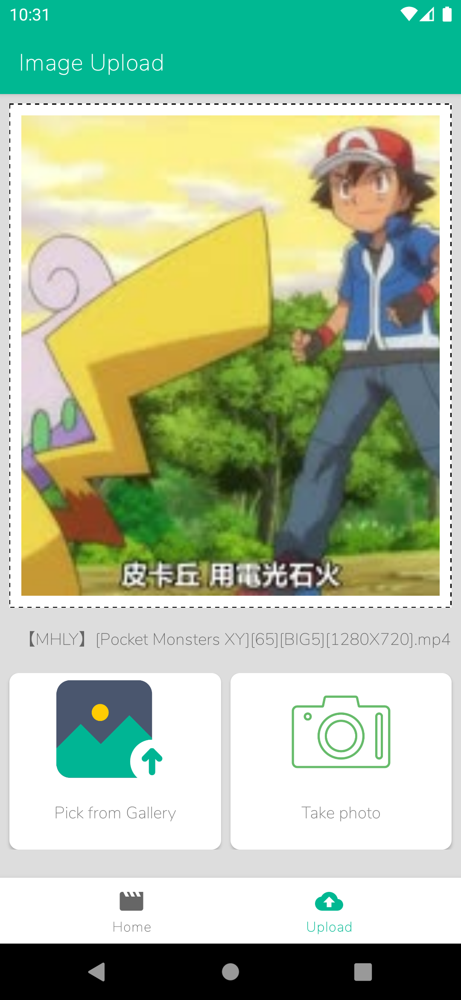

# Anime App

#Download here :  * [KromAnime App](https://docs.google.com/uc?export=download&id=1OYVyc2V1mxHRe1fT3rZWnFYl-vzbJtDL) 
Top 25 Anime Page:

The app shows a list of the top 25 anime fetched from the Jikan API.
Users can view anime titles and details, even without an internet connection, thanks to local storage using SQLite.
A "Refresh" button allows users to update the list with the latest data.
Image Upload Page:

Users can upload images to the app.
The app uses the Trace.moe API for image recognition to identify anime titles and episodes.
The recognized information (title and episode) is displayed below the uploaded image for user convenience.
This Android app offers two key features: displaying the top 25 anime and providing image-based anime recognition.

* Architecture
    * MVVM - Model View View Model

* AnimeRemoteMediator:
  * Manages data synchronization between the Jikan API and the local SQLite database.
  Fetches the top 25 anime data from the Jikan API and stores it for offline use.
  When the "Top 25 Anime" page is opened, it checks for local data. If absent, it fetches the latest data from the API.

<table>
<tr>
<td>

</td>
<td>

</td>
<td>

</td>
</tr>

<tr>
<td>

</td>
<td>

</td>
<td>

</td>
</tr>
</table>

## Tech-stack
* Tech-stack
    * [Kotlin](https://kotlinlang.org/) - a cross-platform, statically typed, general-purpose programming language with type inference.
    * [Coroutines](https://kotlinlang.org/docs/reference/coroutines-overview.html) - perform background operations.
    * [Flow](https://kotlinlang.org/docs/reference/coroutines/flow.html) - handle the stream of data asynchronously that executes sequentially.
    * [Hilt](https://developer.android.com/training/dependency-injection/hilt-android) - Hilt is a dependency injection library for Android that reduces the boilerplate of doing manual dependency injection in your project.
    * [Retrofit](https://square.github.io/retrofit/) - A type-safe HTTP client for Android.
    * [Jetpack](https://developer.android.com/jetpack)
        * [Room](https://developer.android.com/topic/libraries/architecture/room) - a persistence library provides an abstraction layer over SQLite.
        * [Lifecycle](https://developer.android.com/topic/libraries/architecture/lifecycle) - perform action when lifecycle state changes.
        * [ViewModel](https://developer.android.com/topic/libraries/architecture/viewmodel) - store and manage UI-related data in a lifecycle conscious way.
        * [Jetpack Navigation](https://developer.android.com/guide/navigation/navigation-getting-started) -  Implement navigation, from simple button clicks to more complex patterns, such as app bars and the navigation drawer.

